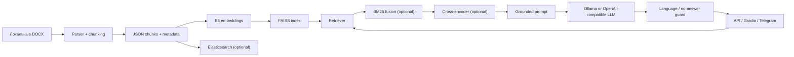

# RAG для нормативно-правовой базы социальной поддержки

Production-oriented RAG-сервис для поиска и генерации ответов по русскоязычным нормативно-правовым документам. Проект демонстрирует полный NLP-контур: разбор DOCX, построение индекса, hybrid retrieval, reranking, grounded generation, API/UI-интеграции и offline evaluation.

> Репозиторий не содержит исходных пользовательских документов, весов моделей, FAISS-индексов и экспериментальных XLSX. Их нужно подготовить локально. Это намеренное ограничение для безопасной публичной публикации.

## Возможности

- DOCX → структурированные JSON-чанки с метаданными;
- multilingual E5 embeddings и FAISS cosine search;
- опциональный BM25 hybrid retrieval и cross-encoder reranking;
- Ollama либо OpenAI-compatible LLM (включая vLLM/gateway);
- FastAPI endpoints для health, readiness, search и ask;
- Gradio UI, Telegram profile и отдельный Elasticsearch search API;
- RAGAS/MLflow evaluation profile без вымышленных benchmark-результатов;
- typed settings, structured JSON logs, pytest, Ruff, mypy, secret scanning и Docker CI.

## Архитектура



Основной runtime собирается в `src/utils/rag_runtime.py`. Модели и индекс инициализируются лениво при первом endpoint, которому нужен retrieval; `/health` и импорт приложения остаются лёгкими. Prompt является production-логикой в `src/utils/rag_pipeline.py`. Внешние документы считаются недоверенным содержимым: модель должна использовать их как факты, а не как инструкции.

## Стек

Python 3.12, FastAPI, Pydantic Settings, SentenceTransformers, PyTorch CPU, FAISS, rank-bm25, Elasticsearch 8, httpx, Gradio, python-telegram-bot, pytest, Ruff, mypy, uv, Docker/Compose, RAGAS и MLflow.

## Быстрый старт

Требования: Python 3.12, [uv](https://docs.astral.sh/uv/), Git. Для контейнерного запуска — Docker Engine с Compose v2. Для локальной генерации — Ollama либо доступный OpenAI-compatible endpoint.

```bash
git clone <repository-url>
cd rag_project
uv sync --group dev
cp .env.example .env
```

На Windows используйте `Copy-Item .env.example .env`.

Поместите разрешённые к использованию документы в `data/raw_docx/`, затем подготовьте чанки существующим ingestion-кодом и индекс:

```bash
uv run python scripts/build_index.py
```

`scripts/build_index.py` ожидает подготовленные JSON-чанки в `data/chunks_json/`. Парсер находится в `src/utils/process.py`; формат и источник данных зависят от конкретной поставки и не публикуются вместе с кодом.

Запуск API:

```bash
uv run uvicorn main:app --host 0.0.0.0 --port 8000
```

Проверка:

```bash
curl http://localhost:8000/api/v1/health
curl -X POST http://localhost:8000/api/v1/search \
  -H "Content-Type: application/json" \
  -H "Authorization: Bearer $API_SECRET" \
  -d '{"query":"единовременная денежная выплата","top_k":5}'
```

Swagger UI: `http://localhost:8000/docs`. Если `API_SECRET` пуст в development/test, auth отключён. В production секрет обязателен.

## Конфигурация

Все runtime-параметры описаны в `.env.example` и валидируются `src/settings/config.py`. Основные группы:

- `APP_ENV`, `LOG_LEVEL`, `API_SECRET` — профиль, logging и API auth;
- `INDEX_*`, `TOP_K`, `USE_BM25`, `USE_RERANKER` — retrieval;
- `LLM_PROVIDER`, `OPENAI_*`, `OLLAMA_*`, `LLM_TIMEOUT` — generation;
- `ES_*`, `GRADIO_*`, `TELEGRAM_BOT_TOKEN` — интеграции.

Никогда не коммитьте `.env`. `OPENAI_API_KEY` может быть пустым только для gateway, который не требует auth. В production используйте secret manager платформы.

## Docker Compose

После локального построения `data/faiss_index`:

```bash
docker compose config --quiet
docker compose up --build rag-api
docker compose up --build
```

Второй вариант запускает API, Elasticsearch search API и Gradio. Профили:

```bash
docker compose --profile ollama up --build
docker compose --profile telegram up --build telegram-bot
```

Образ собирается из `uv.lock`, использует CPU-only PyTorch, multi-stage build и непривилегированного пользователя. Данные монтируются read-only и не попадают в build context.

## Проверки разработчика

```bash
uv run ruff format --check src tests main.py
uv run ruff check src tests main.py
uv run mypy src/settings src/schemas src/api src/utils/generator.py src/utils/output_guard.py
uv run pytest -m unit
uv run pytest -m integration
uv run pre-commit run --all-files
docker compose config --quiet
docker build --target runtime -t rag-kb-service:local .
```

Evaluation-зависимости отделены от runtime:

```bash
uv sync --group dev --extra evaluation
uv run python scripts/eval_ragas_stage1.py --help
```

Методика и ограничения описаны в [docs/evaluation.md](docs/evaluation.md). Репозиторий намеренно не заявляет метрики без воспроизводимого публичного набора данных.

## CI

GitHub Actions на `push` и `pull_request` выполняет format/lint/type checks, раздельные unit/integration tests, smoke import, detect-secrets + Gitleaks, контроль крупных файлов, Compose validation и BuildKit build с GHA cache. CD не добавлен: публикацию образа следует подключать только после выбора registry, политики тегов, SBOM/signing и целевого окружения.

## Структура

```text
.
├── .github/workflows/ci.yml
├── docs/                       # evaluation и engineering decisions
├── scripts/                    # ingestion/evaluation/diagnostic CLI
├── src/
│   ├── api/                    # FastAPI routers, middleware, schemas boundary
│   ├── integrations/           # Elasticsearch, Gradio, Telegram
│   ├── schemas/                # API contracts
│   ├── settings/               # validated runtime configuration
│   └── utils/                  # embedding, retrieval, generation, RAG, evaluation
├── tests/unit
├── tests/integration
├── Dockerfile
├── docker-compose.yml
├── pyproject.toml
└── uv.lock
```

## Инженерные компромиссы и ограничения

- FAISS — локальный single-process индекс; нет multi-tenant namespace и online update transaction.
- Elasticsearch реализован отдельным lexical-search сервисом и пока не включён в единый production retrieval policy.
- Prompt имеет явный `legal-rag-v1`, но пока хранится в коде без внешнего registry; изменение требует regression eval.
- Language guard иногда делает второй LLM-вызов, увеличивая latency и cost.
- Нет публичного обезличенного gold dataset, поэтому CI проверяет контракты, но не semantic quality threshold.
- Юридические ответы не заменяют консультацию специалиста; source freshness и право публикации документов должны проверяться владельцем поставки.

Следующие шаги: prompt registry, tenant-scoped indices, request/trace IDs, retrieval and generation latency metrics, reproducible anonymized eval fixture, quality gates, SBOM + image signing и controlled registry publication.

## Участие, безопасность и лицензия

См. [CONTRIBUTING.md](CONTRIBUTING.md) и [SECURITY.md](SECURITY.md). Код распространяется по MIT License; права на документы, модели и внешние данные этой лицензией не предоставляются.
