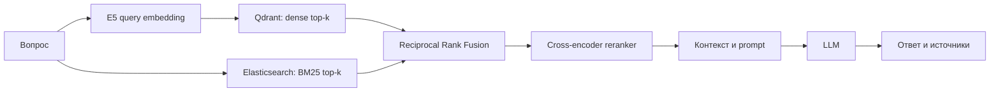
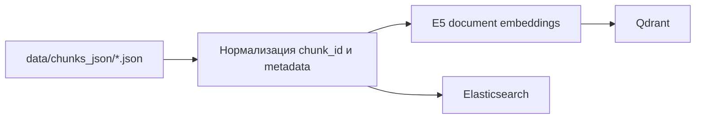

# RAG Social Treasury

Сервис отвечает на вопросы по русскоязычной базе нормативных документов. Поиск строится из двух независимых веток: семантический поиск в Qdrant и BM25-поиск в Elasticsearch. Результаты объединяются через Reciprocal Rank Fusion (RRF), после чего cross-encoder reranker выбирает фрагменты для LLM.

## Как проходит запрос



Dense- и sparse-поиск выполняются параллельно. RRF использует позиции документов в выдаче, а не исходные scores: cosine similarity Qdrant и BM25 score Elasticsearch нельзя корректно складывать напрямую. Reranker применяется после fusion и работает с общим пулом кандидатов.

При индексации один набор чанков записывается в оба хранилища:



## Стек

- Python 3.12, FastAPI, Pydantic Settings;
- SentenceTransformers и multilingual E5 embeddings;
- Qdrant 1.18 для dense vectors;
- Elasticsearch 8.15 для BM25;
- cross-encoder reranker;
- Ollama или OpenAI-compatible LLM endpoint;
- pytest, Ruff, mypy, pre-commit;
- Docker Compose и GitHub Actions;
- MLflow и RAGAS в optional evaluation profile.

## Подготовка данных

Индексатор читает `data/chunks_json/*.json`. Каждый файл должен содержать JSON-массив:

```json
[
  {
    "doc_id": "benefits-2026",
    "source_file": "benefits.docx",
    "section": "Назначение выплаты",
    "clause": "2.1",
    "language": "ru",
    "text": "Назначение выплаты осуществляет ..."
  }
]
```

Обязателен только непустой `text`. Поля metadata используются в источниках и фильтрах. `chunk_id` формируется детерминированно из идентификатора документа, файла, пункта и позиции чанка.

## Запуск через Docker Compose

Скопируйте настройки и при необходимости измените LLM endpoint:

```bash
cp .env.example .env
```

Запустите хранилища:

```bash
docker compose up -d qdrant elasticsearch
```

Постройте оба индекса из `data/chunks_json`:

```bash
docker compose --profile indexing run --rm indexer
```

Запустите API и интерфейс:

```bash
docker compose up -d rag-api es-search-api gradio-ui
```

Сервисы:

- RAG API: `http://localhost:8000/docs`;
- Gradio: `http://localhost:7860`;
- Qdrant dashboard: `http://localhost:6333/dashboard`;
- Elasticsearch: `http://localhost:9200`;
- отдельный Elasticsearch API: `http://localhost:8010/docs`.

Для локальной LLM через Ollama:

```bash
docker compose --profile ollama up -d ollama
docker compose exec ollama ollama pull qwen2.5:7b-instruct
```

После этого задайте в `.env` `LLM_PROVIDER=ollama`.

## Локальный запуск Python

Установите [uv](https://docs.astral.sh/uv/) и зависимости:

```bash
uv sync --group dev
```

Qdrant и Elasticsearch всё равно должны быть доступны. Для хранилищ из Compose установите локальные адреса:

```bash
QDRANT_URL=http://localhost:6333
ES_URL=http://localhost:9200
```

Постройте индексы и запустите API:

```bash
uv run python scripts/build_index.py
uv run uvicorn main:app --reload
```

В PowerShell переменные задаются через `$env:QDRANT_URL` и `$env:ES_URL`.

## Основные настройки

| Переменная | Назначение | Значение по умолчанию |
|---|---|---|
| `QDRANT_URL` | Qdrant REST endpoint | `http://localhost:6333` |
| `QDRANT_COLLECTION` | dense collection | `moscow_kb` |
| `ES_URL` | Elasticsearch endpoint | `http://localhost:9200` |
| `ES_INDEX` | BM25 index | `kb_chunks` |
| `DENSE_CANDIDATES_K` | кандидаты из Qdrant | `50` |
| `SPARSE_CANDIDATES_K` | кандидаты из Elasticsearch | `50` |
| `RRF_K` | константа RRF | `60` |
| `USE_RERANKER` | включить cross-encoder | `true` |
| `RERANKER_CANDIDATES_K` | размер пула reranker | `50` |
| `TOP_K` | итоговое число фрагментов | `5` |
| `LLM_PROVIDER` | `ollama` или OpenAI-compatible endpoint | `ollama` локально |
| `API_SECRET` | Bearer token API | обязателен при `APP_ENV=production` |

Полный набор безопасных примеров находится в `.env.example`.

## Пример запроса

```bash
curl -X POST http://localhost:8000/api/v1/search \
  -H "Content-Type: application/json" \
  -d '{"query":"кто назначает выплату", "top_k":5}'
```

Генерация ответа:

```bash
curl -X POST http://localhost:8000/api/v1/ask \
  -H "Content-Type: application/json" \
  -d '{"question":"Кто назначает выплату?", "top_k":5}'
```

Если задан `API_SECRET`, добавьте `Authorization: Bearer <token>`.

## Проверки

```bash
uv run ruff format --check src tests main.py
uv run ruff check src tests main.py
uv run mypy src/settings src/schemas src/api src/utils
uv run pytest -m unit
uv run pytest -m integration
docker compose config --quiet
docker build --target runtime -t rag-kb-service:local .
```

Локальные hooks:

```bash
uv run pre-commit install
uv run pre-commit run --all-files
```

CI выполняет format/lint/type checks, unit и integration tests, secret scan, проверку размера отслеживаемых файлов, Compose validation и сборку Docker image.

## Структура

```text
src/
├── api/                    FastAPI endpoints и middleware
├── integrations/           Gradio, Telegram, Elasticsearch API
├── schemas/                API-схемы
├── settings/               типизированная конфигурация
└── utils/
    ├── embedder.py         E5 embeddings
    ├── vector_store.py     Qdrant adapter
    ├── sparse_store.py     Elasticsearch BM25 adapter
    ├── retriever.py        parallel retrieval, RRF, reranking
    ├── rag_pipeline.py     prompt и сборка контекста
    └── generator.py        LLM client
scripts/
├── build_index.py          rebuild Qdrant и Elasticsearch
└── eval_ragas_stage1.py    offline evaluation
tests/
├── unit/
└── integration/
```

## Evaluation

Каркас offline-оценки находится в `scripts/eval_ragas_stage1.py`, описание протокола — в `docs/evaluation.md`. Перед сравнением конфигураций нужно фиксировать corpus snapshot, embedding model, candidate limits, `RRF_K`, reranker, prompt version и LLM model. В проекте не заявлены численные результаты без воспроизводимого набора данных.

## Ограничения

- Rebuild Qdrant и Elasticsearch не является распределённой транзакцией. При сбое индексатор нужно запустить повторно.
- Compose-конфигурация привязывает порты хранилищ к localhost и рассчитана на локальную разработку. Для внешнего deployment нужны TLS, аутентификация Qdrant/Elasticsearch и управление секретами вне `.env`.
- API-фильтры metadata сейчас применяются после retrieval; для больших коллекций их следует перенести в Qdrant payload filters и Elasticsearch bool filters.
- Коллекция и индекс общие. Для multi-tenant режима необходим обязательный `tenant_id` в payload и фильтрах обеих веток.
- При недоступности одного из retrieval backends запрос завершается ошибкой; degraded dense-only/sparse-only policy пока не определена.
- Изменение retrieval-параметров требует offline evaluation, поскольку оно меняет состав контекста для LLM.

## Развитие

Ближайшие инженерные задачи: tenant isolation, versioned collections с atomic alias switch, retrieval metrics, трассировка по request ID, regression dataset для CI и публикация контейнера в registry после прохождения quality gates.

## Участие и безопасность

Правила разработки описаны в `CONTRIBUTING.md`, сообщения об уязвимостях — в `SECURITY.md`. Код распространяется по лицензии MIT (`LICENSE`).
